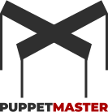

<p align="center">
  
</p>

<h1 align="center">Puppet Master</h1>

<p align="center">
  <strong>A config-driven studio toolkit for building client websites - fast, secure, and production-ready</strong>
</p>

<p align="center">
  <a href="#features">Features</a> •
  <a href="#quick-start">Quick Start</a> •
  <a href="#configuration">Configuration</a> •
  <a href="#deployment">Deployment</a> •
  <a href="#documentation">Documentation</a>
</p>

---

## What is Puppet Master?

Puppet Master is a **config-driven framework** for web agencies to rapidly deploy client websites. The philosophy: **developers define structure and behavior in configuration, clients fill in content via the Admin Panel**.

Perfect for:
- Landing pages & marketing sites
- Portfolio & agency sites
- Small business websites
- SaaS applications with admin panels

---

## Features

### Core

| Feature | Description |
|---------|-------------|
| **4 Application Modes** | `app-only`, `website-app`, `website-admin`, `website-only` - choose your UX |
| **Pure CSS Architecture** | 5-layer CSS system with OKLCH colors, `light-dark()`, no frameworks |
| **Multi-language** | Database-driven i18n with automatic RTL support (Hebrew, Arabic) |
| **Theme System** | Light/dark mode with automatic theme-aware logo switching |
| **One-pager Toggle** | Switch between scroll-based anchors or route-based navigation |
| **Admin Panel** | Built-in CMS for settings, portfolios, translations, users, contacts |

### Backend

| Feature | Description |
|---------|-------------|
| **Dual Data Source** | SQLite database OR external REST API (with hybrid mode) |
| **External API Integration** | OAuth 2.0/JWT auth, circuit breaker, retry logic, caching |
| **Image Processing** | Sharp-based WebP conversion, automatic thumbnails |
| **Video Processing** | FFmpeg compression (optional) |
| **WebSocket Support** | Real-time notifications, room-based messaging |
| **Contact Form** | Email confirmation + Telegram notifications |

### Security

| Feature | Description |
|---------|-------------|
| **RBAC** | Three roles: Master (developer), Admin (client), Editor (employee) |
| **CSRF Protection** | Double-submit cookie pattern |
| **Security Headers** | CSP, HSTS, X-Frame-Options, and more |
| **Rate Limiting** | Login and contact form protection |
| **Account Lockout** | Automatic after failed login attempts |
| **Audit Logging** | Security event tracking |
| **File Validation** | Magic byte verification for uploads |

### DevOps

| Feature | Description |
|---------|-------------|
| **Docker** | Multi-stage Alpine builds |
| **Kamal** | Zero-downtime deployments |
| **Ansible** | Server provisioning automation |
| **Traefik** | Reverse proxy with automatic SSL |
| **Health Monitoring** | Uptime Kuma integration |
| **Structured Logging** | Pino JSON logging |

---

## Tech Stack

| Category | Technology |
|----------|------------|
| Framework | Nuxt 3 (Vue 3.5, TypeScript) |
| Backend | Nitro (H3) |
| Database | SQLite + Drizzle ORM |
| Styling | Pure CSS (OKLCH, CSS Layers) |
| State | Pinia |
| i18n | @nuxtjs/i18n (database-driven) |
| Icons | unplugin-icons + Tabler |
| Deployment | Docker + Kamal + Traefik |

---

## Quick Start

### Prerequisites

- Node.js 20+
- pnpm (recommended) or npm

### Installation

```bash
# Clone and install
git clone <repository-url>
cd puppet-master/app
pnpm install

# Initialize database
pnpm db:push    # Apply schema
pnpm db:seed    # Seed initial data

# Start development
pnpm dev
```

Open `http://localhost:3000`

### Default Accounts

| Email | Password | Role |
|-------|----------|------|
| master@example.com | master123 | Master (full access) |
| admin@example.com | admin123 | Admin (client access) |
| editor@example.com | editor123 | Editor (content only) |

> **Important**: Change these credentials before deploying to production!

---

## Configuration

All build-time configuration is in `app/puppet-master.config.ts`:

```typescript
export default {
  // Application mode
  mode: 'website-admin', // 'app-only' | 'website-app' | 'website-admin' | 'website-only'

  // Feature toggles
  features: {
    multiLangs: true,      // Multi-language support
    doubleTheme: true,     // Light/dark mode
    onepager: true,        // One-pager vs SPA mode
    pwa: false,            // Progressive Web App
    verticalNav: false,    // Vertical header navigation
    contactEmailConfirmation: true,  // Send confirmation emails
    contactTelegramNotify: true      // Telegram notifications
  },

  // Supported locales
  locales: [
    { code: 'en', iso: 'en-US', name: 'English', dir: 'ltr' },
    { code: 'ru', iso: 'ru-RU', name: 'Русский', dir: 'ltr' },
    { code: 'he', iso: 'he-IL', name: 'עברית', dir: 'rtl' }
  ],
  defaultLocale: 'en',

  // Data source
  dataSource: {
    provider: 'database' // 'database' | 'api' | 'hybrid'
  },

  // Storage
  storage: {
    provider: 'local', // 'local' | 's3'
    local: { uploadDir: 'uploads' }
  },

  // Brand colors (4 primitives - everything else auto-calculated)
  colors: {
    black: '#2f2f2f',
    white: '#f0f0f0',
    brand: '#aa0000',
    accent: '#0f172a'
  },

  // Settings schema (editable in admin panel)
  settings: [
    { key: 'contact.email', type: 'email', group: 'contact', label: 'Email' },
    { key: 'contact.phone', type: 'tel', group: 'contact', label: 'Phone' },
    { key: 'social.instagram', type: 'url', group: 'social', label: 'Instagram' },
    // ... more settings
  ]
}
```

### Environment Variables

Copy `.env.example` to `.env` and configure:

```bash
# Required
DATABASE_URL=./data/sqlite.db

# Optional - Email
SMTP_HOST=smtp.example.com
SMTP_PORT=587
SMTP_USER=user@example.com
SMTP_PASS=password
SMTP_FROM="Site Name <noreply@example.com>"

# Optional - Telegram notifications
TELEGRAM_BOT_TOKEN=your_bot_token
TELEGRAM_CHAT_ID=your_chat_id

# Optional - S3 storage
S3_ENDPOINT=https://s3.example.com
S3_BUCKET=my-bucket
S3_ACCESS_KEY=key
S3_SECRET_KEY=secret
```

---

## Deployment

### Quick Deploy with Kamal

```bash
# 1. Provision server (first time only)
cd ansible
cp inventory.example.yml inventory.yml
# Edit inventory.yml with your server IP
pnpm server:provision

# 2. Configure secrets
cp .kamal/secrets.example .kamal/secrets
# Edit .kamal/secrets with all values

# 3. Deploy
pnpm deploy:setup  # First time only
pnpm deploy        # Deploy application
```

### Docker

```bash
# Build
docker build -t puppet-master .

# Run
docker run -p 3000:3000 \
  -v $(pwd)/data:/app/data \
  -e DATABASE_URL=/app/data/sqlite.db \
  puppet-master
```

See [docs/DEPLOYMENT.md](docs/DEPLOYMENT.md) for full deployment guide.

---

## Documentation

### Guides

| Document | Description |
|----------|-------------|
| [GETTING_STARTED.md](docs/GETTING_STARTED.md) | Step-by-step setup guide |
| [CONFIGURATION.md](docs/CONFIGURATION.md) | Configuration reference |
| [DEPLOYMENT.md](docs/DEPLOYMENT.md) | Deployment with Docker/Kamal |
| [EXTERNAL_API.md](docs/EXTERNAL_API.md) | External API integration |
| [WEBSOCKET.md](docs/WEBSOCKET.md) | WebSocket setup |

### Reference

| Document | Description |
|----------|-------------|
| [API_REFERENCE.md](docs/API_REFERENCE.md) | API endpoints |
| [CSS_ARCHITECTURE.md](docs/styles/CSS_ARCHITECTURE.md) | CSS system |
| [CSS_QUICK_REFERENCE.md](docs/styles/CSS_QUICK_REFERENCE.md) | CSS classes lookup |

### Operations

| Document | Description |
|----------|-------------|
| [MONITORING.md](docs/MONITORING.md) | Health checks & logging |
| [SECURITY.md](docs/SECURITY.md) | Security features & checklist |
| [ADMIN_GUIDE.md](docs/ADMIN_GUIDE.md) | Admin panel user guide |

---

## Project Structure

```
app/
├── app/                      # Nuxt app directory
│   ├── assets/css/           # Pure CSS system (50+ files)
│   │   ├── colors/           # 4 color primitives + auto-calculated
│   │   ├── layout/           # Page structure, breakpoints
│   │   ├── skeleton/         # Header, footer, navigation
│   │   ├── ui/               # Forms, cards, modals
│   │   └── animations/       # Keyframes, transitions
│   ├── components/           # Vue components (Atomic Design)
│   │   ├── atoms/            # Basic elements
│   │   ├── molecules/        # Component combinations
│   │   ├── organisms/        # Complex components
│   │   └── sections/         # Page sections
│   ├── composables/          # Vue composables (13+)
│   ├── layouts/              # Page layouts
│   ├── pages/                # Route pages
│   │   ├── admin/            # Admin panel pages
│   │   └── portfolio/        # Portfolio pages
│   └── puppet-master.config.ts
├── server/                   # Nitro server
│   ├── api/                  # API endpoints (30+)
│   ├── database/             # Schema, migrations, seed
│   ├── middleware/           # Auth, CSRF, security headers
│   ├── plugins/              # Server plugins
│   └── utils/                # Server utilities
├── i18n/                     # Internationalization
├── docs/                     # Documentation
├── tests/                    # Vitest tests (88+)
├── ansible/                  # Server provisioning
├── Dockerfile                # Production container
└── deploy.yml                # Kamal configuration
```

---

## Commands

### Development

```bash
pnpm dev          # Start dev server
pnpm build        # Build for production
pnpm preview      # Preview production build
pnpm typecheck    # TypeScript check
pnpm lint         # Lint code
```

### Database

```bash
pnpm db:push      # Push schema changes
pnpm db:seed      # Seed initial data
pnpm db:reset     # Reset database
pnpm db:studio    # Open Drizzle Studio
```

### Testing

```bash
pnpm test         # Run all tests
pnpm test:unit    # Unit tests only
pnpm test:api     # API tests only
pnpm test:e2e     # E2E tests only
```

### Deployment

```bash
pnpm deploy           # Deploy with Kamal
pnpm deploy:rollback  # Rollback to previous
pnpm deploy:logs      # View logs
pnpm deploy:shell     # Shell into container
```

---

## License

MIT

---

<p align="center">
  Built for web agencies who value speed, security, and maintainability.
</p>
