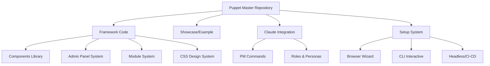
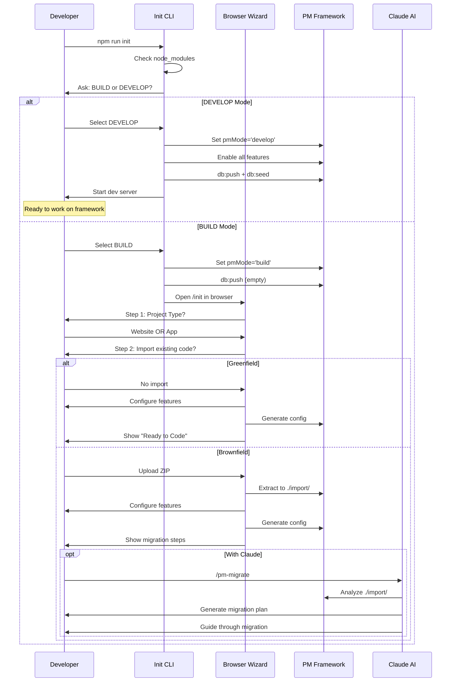
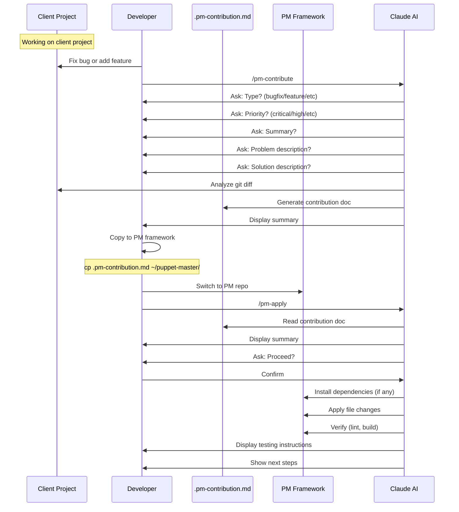
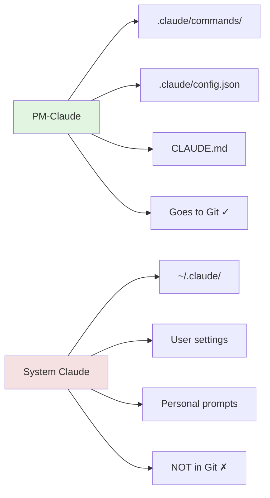
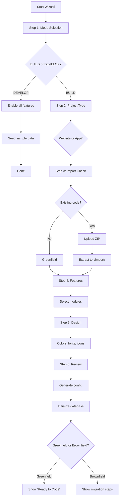

# Puppet Master: App Creation & Contribution Workflows Analysis

# Puppet Master: App Creation & Contribution Workflows Analysis

## Executive Summary

This document provides a comprehensive analysis of how Puppet Master (PM) handles:
1. **Creating new apps** on the PM framework basis
2. **Contributing back** to the PM framework from client projects
3. **Current implementation status** of both Claude-based and automated workflows

## Table of Contents

1. [System Overview](#system-overview)
2. [App Creation Workflows](#app-creation-workflows)
3. [Contribution Workflows](#contribution-workflows)
4. [Claude Integration](#claude-integration)
5. [Automated Flows](#automated-flows)
6. [Current Implementation Status](#current-implementation-status)
7. [Gap Analysis](#gap-analysis)
8. [Recommendations](#recommendations)

---

## System Overview

### What is Puppet Master?

Puppet Master is a **config-driven studio toolkit** for building client websites and applications. It's both:
- **A Framework** — Reusable infrastructure for building websites/apps
- **A Showcase** — Working reference implementation demonstrating all capabilities

The same codebase serves both purposes, controlled by the `pmMode` configuration.

### Core Architecture



### Three Operating Modes

| Mode | Purpose | Use Case |
|------|---------|----------|
| **unconfigured** | Fresh clone state | Initial setup required |
| **build** | Client project mode | Creating websites/apps for clients |
| **develop** | Framework development | Working on PM itself |

---

## App Creation Workflows

### Overview

PM supports **two primary scenarios** for creating new apps:

1. **Greenfield** — Starting from scratch
2. **Brownfield** — Importing existing code

Both scenarios use the same entry point but diverge based on user choices.

### Workflow Diagram



### 1. Greenfield Workflow (New Project)

**Steps:**

1. **Clone & Install**
   ```bash
   git clone puppet-master my-project
   cd my-project/app
   npm install
   ```

2. **Initialize**
   ```bash
   npm run init
   # OR with Claude:
   /pm-init
   ```

3. **Choose BUILD Mode**
   - Terminal prompt: "BUILD or DEVELOP?"
   - Select: BUILD

4. **Complete Browser Wizard** at `http://localhost:3000/init`
   - **Step 1:** Project Type (Website or App)
   - **Step 2:** Admin Panel (Enable/Disable)
   - **Step 3:** Import Check (Select "No")
   - **Step 4:** Modules (Blog, Portfolio, Team, etc.)
   - **Step 5:** Languages (en, ru, he, etc.)
   - **Step 6:** Features (Dark mode, PWA, etc.)
   - **Step 7:** Review & Generate

5. **Start Coding**
   - Config generated: `file:app/puppet-master.config.ts`
   - Database initialized
   - Ready to build features

**Key Files:**
- `file:scripts/init-cli.ts` — CLI initialization script
- `file:app/pages/init.vue` — Browser wizard page
- `file:app/puppet-master.config.ts` — Master configuration
- `file:docs/SETUP-WORKFLOWS.md` — Setup documentation

### 2. Brownfield Workflow (Import Existing)

**Steps:**

1. **Clone & Prepare**
   ```bash
   git clone puppet-master my-project
   cd my-project/app
   # Copy existing project to import folder
   cp -r ~/old-project/* ./import/
   npm install
   ```

2. **Initialize**
   ```bash
   npm run init
   ```

3. **Choose BUILD Mode**

4. **Complete Browser Wizard**
   - Same steps as Greenfield
   - **Step 3:** Upload existing project as ZIP
   - Wizard extracts to `./import/` folder

5. **Migration Options**

   **Option A: With Claude Code**
   ```bash
   /pm-migrate
   ```
   - Claude analyzes `./import/` folder
   - Generates comprehensive migration plan
   - Maps components, pages, APIs to PM equivalents
   - Guides step-by-step migration

   **Option B: Manual**
   - Reference files in `./import/` folder
   - Manually port code to PM structure
   - Follow PM patterns and conventions

**Key Files:**
- `file:import/` — Brownfield import folder
- `file:import/PROJECT.md` — Optional project spec template
- `file:.claude/commands/pm-migrate.md` — Claude migration command

### 3. Headless/CI-CD Workflow

For automated deployments without user interaction:

```bash
# Basic website
npm run init -- --headless --mode=build --type=website

# Full-featured website
npm run init -- --headless \
  --mode=build \
  --type=website \
  --modules=blog,portfolio,contact \
  --locales=en,es \
  --dark-mode=true

# Framework development
npm run init -- --headless --mode=develop
```

**Environment Variables Alternative:**
```bash
PM_MODE=build \
PM_TYPE=website \
PM_ADMIN=true \
PM_MODULES="blog,portfolio,contact" \
PM_LOCALES="en,ru" \
npm run init -- --headless
```

**Key Files:**
- `file:scripts/init-cli.ts` — Handles headless mode
- `file:docs/SETUP-WORKFLOWS.md` — Headless documentation

---

## Contribution Workflows

### Overview

PM has a **bidirectional contribution system**:
- **From Client → Framework:** Export fixes/features from client projects
- **From Framework → Client:** Apply contributions to PM framework

This enables improvements made during client work to flow back into the framework.

### Contribution Flow Diagram



### 1. Export Contribution (Client → Framework)

**Command:** `/pm-contribute`

**Location:** Client project (based on PM)

**Process:**

1. **Trigger Export**
   ```bash
   /pm-contribute
   # OR with summary:
   /pm-contribute "Fixed header scroll bug"
   ```

2. **Interactive Questions**
   - **Type:** bugfix, feature, enhancement, refactor, docs
   - **Priority:** critical, high, medium, low
   - **Summary:** One-line description
   - **Problem:** What was broken/needed?
   - **Solution:** How was it solved?
   - **Files Changed:** Which files were modified/created/deleted?
   - **Dependencies:** Any new packages?
   - **Breaking Changes:** What might break?
   - **Testing:** How to verify?

3. **Generate Document**
   - Creates `file:.pm-contribution.md` in project root
   - Includes:
     - Meta information (ID, type, priority, date)
     - Problem and solution descriptions
     - Domains affected (Frontend, Backend, Database, etc.)
     - File changes with diffs
     - Dependencies and breaking changes
     - Testing instructions

4. **Copy to PM Framework**
   ```bash
   cp .pm-contribution.md ~/puppet-master/
   ```

**Key Files:**
- `file:.claude/commands/pm-contribute.md` — Export command definition
- `file:docs/PM-CLAUDE-SYSTEM.md` — Documentation

### 2. Apply Contribution (Framework ← Client)

**Command:** `/pm-apply`

**Location:** PM framework repository

**Process:**

1. **Trigger Application**
   ```bash
   /pm-apply
   # OR specify file:
   /pm-apply ./path/to/contribution.md
   # OR review only:
   /pm-apply --review
   ```

2. **Read & Parse**
   - Finds `file:.pm-contribution.md` in root
   - Parses all sections
   - Displays comprehensive summary

3. **Conflict Detection**
   - Checks if files exist
   - Compares current content with expected base
   - Warns about potential conflicts
   - Offers resolution options

4. **Confirmation**
   - Shows what will change
   - Lists files to modify/create/delete
   - Lists dependencies to install
   - Asks for confirmation

5. **Apply Changes**
   - Install dependencies (if any)
   - Modify files using diffs
   - Create new files
   - Delete removed files
   - Verify with lint and build

6. **Testing & Commit**
   - Display testing instructions
   - Suggest commit message
   - Recommend cleanup

**Key Files:**
- `file:.claude/commands/pm-apply.md` — Apply command definition
- `file:docs/PM-CLAUDE-SYSTEM.md` — Documentation

### Contribution Document Structure

```markdown
# PM Contribution

## Meta
- ID: PM-2026-0118-001
- Type: bugfix
- Priority: high
- Created: 2026-01-18
- Source: Client Project

## Summary
Fixed header scroll bug causing navigation to disappear

## Problem
Header navigation was disappearing when scrolling down on mobile devices...

## Solution
Added CSS position:sticky with proper z-index handling...

## Domains Affected
- [x] Frontend
- [ ] Backend
- [ ] Database
- [x] Styles
- [ ] Config
- [ ] Types
- [ ] Docs

## Files Changed

### Modified: `app/components/organisms/TheHeader.vue`
**Purpose**: Fixed scroll behavior

\`\`\`diff
- <header class="header">
+ <header class="header header--sticky">
\`\`\`

## Dependencies
none

## Breaking Changes
none

## Testing
1. Open site on mobile
2. Scroll down
3. Verify header stays visible
```

---

## Claude Integration

### Overview

PM includes **PM-Claude** — a specialized AI co-pilot that understands the entire PM framework. This is separate from the user's personal Claude settings.

### Two Claude Systems



| Aspect | PM-Claude | System Claude |
|--------|-----------|---------------|
| **Location** | `file:.claude/` in repo | `~/.claude/` in home |
| **Purpose** | PM-specific commands | General assistance |
| **Goes to Git** | ✓ Yes | ✗ No |
| **Scope** | Framework-aware | General-purpose |

### PM Commands

All commands are defined in `file:.claude/commands/` directory:

| Command | Purpose | Status |
|---------|---------|--------|
| `/pm-init` | Main entry point — routes to wizard or status | ✅ Active |
| `/pm-dev` | Run development server | ✅ Active |
| `/pm-status` | Show configuration state | ✅ Active |
| `/pm-contribute` | Export feature/fix to PM framework | ✅ Active |
| `/pm-apply` | Apply contribution from other project | ✅ Active |
| `/pm-migrate` | AI-powered migration analysis (brownfield) | ⚠️ Deprecated |
| `/pm-start` | Start dev server | ⚠️ Deprecated (use /pm-dev) |

**Additional Commands:**
- `file:.claude/commands/pm-team.md` — Team management
- `file:.claude/commands/pm-team-all.md` — All team members
- Language-specific commands: `pm-us.md`, `pm-ru.md`, `pm-il.md`, `pm-ch.md`, `pm-fr.md`, `pm-jp.md`

### Command Details

#### `/pm-init` — Initialize Project

**Behavior based on pmMode:**

| pmMode | Action |
|--------|--------|
| `unconfigured` | Ask BUILD or DEVELOP → Start wizard |
| `build` or `develop` | Show status → Ask what to do |

**Flags:**
- `--reset` — Reset to unconfigured state

**Implementation:** `file:.claude/commands/pm-init.md`

#### `/pm-dev` — Run Dev Server

**Purpose:** Simple command to start dev server

**Steps:**
1. Kill existing server on :3000
2. Install dependencies if needed
3. Start `npm run dev`
4. Display URLs

**Flags:**
- `--fresh` — Reset database, seed, then start
- `--setup` — Start and open `/setup`

**Implementation:** `file:.claude/commands/pm-dev.md`

#### `/pm-status` — Show Configuration

**Purpose:** Display current PM configuration state

**Shows:**
- Mode (unconfigured, build, develop)
- Project type (website, app)
- Admin enabled/disabled
- Features and modules
- Database status
- Dev server status

**Flags:**
- `--config` — Show raw config values
- `--modules` — Show module details only
- `--db` — Show database details

**Implementation:** `file:.claude/commands/pm-status.md`

### Claude Configuration

**Project Config:** `file:.claude/config.json`
```json
{
  "project": "Puppet Master",
  "stack": {
    "frontend": "Nuxt3 (Vue 3.5, TypeScript)",
    "backend": "Nitro (H3)",
    "database": "SQLite (Drizzle ORM)"
  },
  "roles": ["fullstack-nuxt", "frontend", "backend", "security", "ux-ui", "devops"],
  "defaultRole": "fullstack-nuxt"
}
```

**Project Instructions:** `file:CLAUDE.md`
- Vision and stack overview
- Critical rules and patterns
- PM commands reference
- Workflows and examples

**Detailed Documentation:** `file:docs/PM-CLAUDE-SYSTEM.md`
- Complete command reference
- Workflow descriptions
- Configuration system
- Best practices

---

## Automated Flows

### Overview

PM provides **three setup methods** to accommodate different scenarios:

1. **Browser Wizard** — Visual, interactive (primary method)
2. **CLI Interactive** — Terminal-based prompts
3. **Headless** — Fully automated for CI/CD

### 1. Browser Wizard

**Entry Point:** `file:app/pages/init.vue`

**Flow:**



**Features:**
- Visual interface
- Step-by-step guidance
- ZIP upload for brownfield
- Real-time preview
- Configuration validation

**API Endpoints:**
- `file:server/api/setup/config.get.ts` — Get current config
- `file:server/api/setup/config.post.ts` — Save config
- `file:server/api/setup/import-zip.post.ts` — Upload ZIP
- `file:server/api/setup/import-zip.delete.ts` — Remove ZIP

### 2. CLI Interactive

**Entry Point:** `file:scripts/init-cli.ts`

**Flow:**

```bash
npm run init
```

**Process:**
1. Check if `node_modules` exists → install if needed
2. Check current `pmMode` in config
3. If unconfigured:
   - Ask: "BUILD or DEVELOP?"
   - If DEVELOP: Enable all features, seed data, start server
   - If BUILD: Set build mode, start server, open wizard
4. If already configured:
   - Show status
   - Ask: "Start dev server or Reconfigure?"

**Features:**
- Single question to start
- Automatic dependency installation
- Automatic database setup
- Delegates to browser wizard for detailed config

### 3. Headless Mode

**Entry Point:** `file:scripts/init-cli.ts` with `--headless` flag

**Usage:**

```bash
# Basic
npm run init -- --headless --mode=build --type=website

# Advanced
npm run init -- --headless \
  --mode=build \
  --type=website \
  --modules=blog,portfolio,contact \
  --locales=en,es \
  --dark-mode=true \
  --onepager=false \
  --pwa=false

# Environment variables
PM_MODE=build \
PM_TYPE=website \
PM_MODULES="blog,portfolio" \
npm run init -- --headless
```

**Options:**

| Option | Values | Default | Description |
|--------|--------|---------|-------------|
| `--mode` | build, develop | required | Project mode |
| `--type` | website, app | website | Project type |
| `--admin` | true, false | true | Enable admin panel |
| `--modules` | comma-separated or "all" | contact | Modules to enable |
| `--locales` | comma-separated codes | en | Supported languages |
| `--default-locale` | locale code | first in list | Default language |
| `--dark-mode` | true, false | true | Dark mode toggle |
| `--onepager` | true, false | false | One-page layout |
| `--pwa` | true, false | false | Progressive Web App |

**Features:**
- Non-interactive
- Environment variable support
- CI/CD friendly
- Validates all inputs
- Generates complete config

**CI/CD Example:**

```yaml
# .github/workflows/deploy.yml
- name: Configure PM
  run: npm run init -- --headless --mode=build --type=website --modules=blog,contact
```

### Configuration Writer

**Implementation:** `file:scripts/lib/config-writer.ts`

**Responsibilities:**
- Reads current `file:app/puppet-master.config.ts`
- Updates specific fields using regex
- Preserves formatting and comments
- Validates changes
- Writes back to file

**Key Functions:**
- `setConfigMode(mode)` — Update pmMode
- `writeFullConfig(config)` — Update all fields
- `replaceBoolean(str, key, value)` — Update boolean flags

---

## Current Implementation Status

### ✅ Fully Implemented

#### App Creation
- ✅ **Greenfield workflow** — Complete, tested
- ✅ **Browser wizard** — Full UI at `/init`
- ✅ **CLI interactive** — Single-question flow
- ✅ **Headless mode** — CI/CD ready
- ✅ **Configuration system** — `puppet-master.config.ts`
- ✅ **Database initialization** — Schema + seed
- ✅ **Module system** — Blog, Portfolio, Team, etc.
- ✅ **Multi-language support** — i18n with RTL
- ✅ **Theme system** — Light/dark mode

#### Brownfield Support
- ✅ **ZIP upload** — In browser wizard
- ✅ **Import folder** — `./import/` extraction
- ✅ **Project template** — `file:import/PROJECT.md`
- ⚠️ **Migration command** — `/pm-migrate` exists but deprecated

#### Claude Integration
- ✅ **PM commands** — All core commands implemented
- ✅ **Command definitions** — In `file:.claude/commands/`
- ✅ **Project config** — `file:.claude/config.json`
- ✅ **Documentation** — `file:CLAUDE.md`, `file:docs/PM-CLAUDE-SYSTEM.md`
- ✅ **Roles system** — Multiple expert personas

#### Contribution System
- ✅ **Export command** — `/pm-contribute` fully implemented
- ✅ **Apply command** — `/pm-apply` fully implemented
- ✅ **Contribution format** — Structured markdown
- ✅ **Conflict detection** — File comparison
- ✅ **Verification** — Lint and build checks

#### Automated Flows
- ✅ **Init script** — `file:scripts/init-cli.ts`
- ✅ **Config reader** — `file:scripts/lib/config-reader.ts`
- ✅ **Config writer** — `file:scripts/lib/config-writer.ts`
- ✅ **API endpoints** — Setup APIs implemented
- ✅ **Middleware** — Redirect to `/init` when unconfigured

### ⚠️ Partially Implemented

#### Brownfield Migration
- ⚠️ **AI-powered migration** — `/pm-migrate` command exists but marked deprecated
- ⚠️ **Migration plan generation** — Documented but not actively maintained
- ⚠️ **Step-by-step guidance** — Manual process, not automated

**Status:** The brownfield import mechanism (ZIP upload, extraction) works, but the AI-powered migration analysis is deprecated. Users must manually reference files in `./import/` folder.

### ❌ Not Implemented / Missing

#### Migration Automation
- ❌ **Automated code analysis** — No active tool to analyze imported code
- ❌ **Component mapping** — No automatic mapping to PM equivalents
- ❌ **API route conversion** — Manual process
- ❌ **Style migration** — Manual CSS conversion
- ❌ **Dependency analysis** — No automatic package.json comparison

#### Advanced Features
- ❌ **Migration templates** — No predefined migration patterns
- ❌ **Code transformers** — No AST-based code transformation
- ❌ **Diff visualization** — No visual diff tool in wizard
- ❌ **Rollback mechanism** — No automatic rollback for failed migrations

#### Documentation Gaps
- ❌ **Migration best practices** — Limited guidance
- ❌ **Common patterns** — No pattern library for migrations
- ❌ **Troubleshooting guide** — Limited error resolution docs

---

## Gap Analysis

### Critical Gaps

#### 1. Brownfield Migration Automation

**Current State:**
- ZIP upload works
- Files extracted to `./import/`
- `/pm-migrate` command deprecated
- Manual migration required

**Gap:**
- No automated code analysis
- No component mapping
- No migration plan generation
- No step-by-step guidance

**Impact:** High — Brownfield adoption is difficult without automation

**Recommendation:** Revive and enhance `/pm-migrate` command with:
- AST-based code analysis
- Pattern matching for common frameworks
- Automated component mapping
- Interactive migration wizard

#### 2. Migration Documentation

**Current State:**
- Basic setup docs exist
- Contribution workflow documented
- Limited migration guidance

**Gap:**
- No comprehensive migration guide
- No pattern library
- No troubleshooting section
- No video tutorials

**Impact:** Medium — Users struggle without clear guidance

**Recommendation:** Create comprehensive migration documentation:
- Step-by-step migration guide
- Common patterns and solutions
- Framework-specific guides (React → Vue, etc.)
- Video walkthroughs

#### 3. Testing & Validation

**Current State:**
- Lint and build checks in `/pm-apply`
- Manual testing required

**Gap:**
- No automated tests for migrations
- No validation of migrated code
- No regression testing
- No performance benchmarks

**Impact:** Medium — Quality assurance is manual

**Recommendation:** Implement automated testing:
- Unit tests for migrated components
- Integration tests for APIs
- Visual regression tests
- Performance benchmarks

### Minor Gaps

#### 4. Contribution Workflow UX

**Current State:**
- CLI-based contribution export
- Manual file copying
- Text-based review

**Gap:**
- No GUI for contribution review
- No visual diff viewer
- No contribution history
- No contribution marketplace

**Impact:** Low — Current workflow functional but could be improved

**Recommendation:** Enhance contribution UX:
- Web-based contribution viewer
- Visual diff comparison
- Contribution history tracking
- Optional contribution marketplace

#### 5. Headless Mode Features

**Current State:**
- Basic headless mode works
- Environment variable support
- CI/CD friendly

**Gap:**
- No config file input (YAML/JSON)
- No validation feedback
- No dry-run mode
- No config templates

**Impact:** Low — Current implementation sufficient for most cases

**Recommendation:** Add advanced headless features:
- Config file input: `--config=pm.config.json`
- Dry-run mode: `--dry-run`
- Config templates: `--template=blog-site`
- Validation output: `--validate-only`

---

## Recommendations

### Immediate Actions (High Priority)

#### 1. Revive `/pm-migrate` Command

**Goal:** Make brownfield migration practical and efficient

**Tasks:**
1. **Code Analysis Engine**
   - Implement AST parsing for common frameworks
   - Detect framework (React, Angular, etc.)
   - Identify components, pages, routes, APIs
   - Map to PM equivalents

2. **Migration Plan Generator**
   - Create structured migration plan
   - Prioritize by complexity
   - Estimate effort per item
   - Generate checklist

3. **Interactive Guidance**
   - Step-by-step wizard
   - Show current file vs PM pattern
   - Suggest transformations
   - Track progress

4. **Pattern Library**
   - Common component patterns
   - API route conversions
   - State management migrations
   - Styling transformations

**Implementation:**
- Update `file:.claude/commands/pm-migrate.md`
- Create `file:scripts/migrate/` directory
- Add migration utilities
- Integrate with wizard

#### 2. Comprehensive Migration Documentation

**Goal:** Provide clear guidance for all migration scenarios

**Tasks:**
1. **Migration Guide**
   - Create `file:docs/MIGRATION-GUIDE.md`
   - Step-by-step instructions
   - Framework-specific sections
   - Common pitfalls and solutions

2. **Pattern Library**
   - Create `file:docs/MIGRATION-PATTERNS.md`
   - Component patterns
   - API patterns
   - State management patterns
   - Styling patterns

3. **Video Tutorials**
   - Record migration walkthroughs
   - Framework-specific demos
   - Troubleshooting sessions

4. **FAQ Section**
   - Common questions
   - Error messages and solutions
   - Performance optimization

**Implementation:**
- Add to `file:docs/` directory
- Link from main README
- Include in wizard

### Short-term Improvements (Medium Priority)

#### 3. Enhanced Testing & Validation

**Goal:** Ensure quality of migrated code

**Tasks:**
1. **Automated Tests**
   - Component tests
   - API tests
   - Integration tests
   - Visual regression tests

2. **Validation Tools**
   - Code quality checks
   - Performance benchmarks
   - Accessibility audits
   - Security scans

3. **CI/CD Integration**
   - Automated test runs
   - Quality gates
   - Deployment checks

**Implementation:**
- Extend `file:tests/` directory
- Add validation scripts
- Update CI/CD workflows

#### 4. Contribution Workflow Enhancements

**Goal:** Improve contribution experience

**Tasks:**
1. **Web-based Viewer**
   - Create `/admin/contributions` page
   - Visual diff viewer
   - Contribution history
   - Status tracking

2. **Automated Checks**
   - Lint contributions
   - Test contributions
   - Security scan
   - License check

3. **Contribution Templates**
   - Predefined templates
   - Auto-fill common fields
   - Validation rules

**Implementation:**
- Add admin page
- Create contribution API
- Update commands

### Long-term Enhancements (Low Priority)

#### 5. Advanced Headless Features

**Goal:** Support complex CI/CD scenarios

**Tasks:**
1. **Config File Input**
   - Support YAML/JSON config
   - Schema validation
   - Config templates

2. **Dry-run Mode**
   - Preview changes
   - Validate without applying
   - Generate reports

3. **Config Management**
   - Version control
   - Config diff
   - Config merge

**Implementation:**
- Extend `file:scripts/init-cli.ts`
- Add config schemas
- Create templates

#### 6. Contribution Marketplace

**Goal:** Share contributions across projects

**Tasks:**
1. **Marketplace Platform**
   - Web-based marketplace
   - Search and filter
   - Ratings and reviews
   - Installation automation

2. **Package System**
   - Contribution packages
   - Dependency management
   - Version control
   - Update notifications

3. **Community Features**
   - User profiles
   - Contribution stats
   - Discussion forums
   - Documentation wiki

**Implementation:**
- Separate service/platform
- API integration
- CLI commands

---

## Summary

### What's Working Well

✅ **App Creation**
- Greenfield workflow is smooth and well-documented
- Browser wizard provides excellent UX
- CLI and headless modes support all scenarios
- Configuration system is flexible and powerful

✅ **Claude Integration**
- PM commands are well-defined and functional
- Documentation is comprehensive
- Contribution workflow is solid
- Commands are properly separated from user settings

✅ **Automated Flows**
- Init script handles all scenarios
- Config management is robust
- API endpoints are clean
- Middleware handles routing correctly

### What Needs Work

⚠️ **Brownfield Migration**
- `/pm-migrate` command is deprecated
- No automated code analysis
- Manual migration is tedious
- Limited guidance for complex migrations

⚠️ **Documentation**
- Migration guide is minimal
- No pattern library
- Limited troubleshooting help
- No video tutorials

⚠️ **Testing**
- Manual testing required
- No automated validation
- No regression tests
- No performance benchmarks

### Priority Actions

1. **Revive `/pm-migrate`** — Make brownfield practical
2. **Create migration docs** — Provide clear guidance
3. **Add automated tests** — Ensure quality
4. **Enhance contribution UX** — Improve workflow
5. **Add advanced headless** — Support complex CI/CD

### Conclusion

Puppet Master has a **solid foundation** for app creation and contribution workflows. The greenfield path is excellent, and the contribution system is well-designed. The main gap is in **brownfield migration automation**, which needs significant enhancement to make PM practical for importing existing projects.

The recommended approach is to:
1. Focus on reviving and enhancing `/pm-migrate`
2. Create comprehensive migration documentation
3. Add automated testing and validation
4. Gradually enhance other areas based on user feedback

With these improvements, PM will be a complete solution for both new projects and migrations from existing codebases.

---

## Appendix: Key Files Reference

### Core Files

| File | Purpose |
|------|---------|
| `file:CLAUDE.md` | Project instructions for Claude |
| `file:README.md` | Main project documentation |
| `file:CONTRIBUTING.md` | Contribution guidelines |
| `file:app/puppet-master.config.ts` | Master configuration |
| `file:package.json` | NPM scripts and dependencies |

### Documentation

| File | Purpose |
|------|---------|
| `file:docs/PM-SYSTEM-OVERVIEW.md` | System architecture overview |
| `file:docs/PM-CLAUDE-SYSTEM.md` | Claude integration documentation |
| `file:docs/PM-ARCHITECTURE.md` | Detailed architecture |
| `file:docs/SETUP-WORKFLOWS.md` | Setup workflow documentation |

### Scripts

| File | Purpose |
|------|---------|
| `file:scripts/init-cli.ts` | Initialization script |
| `file:scripts/lib/config-reader.ts` | Config reading utilities |
| `file:scripts/lib/config-writer.ts` | Config writing utilities |

### Claude Commands

| File | Purpose |
|------|---------|
| `file:.claude/commands/pm-init.md` | Initialize project |
| `file:.claude/commands/pm-dev.md` | Run dev server |
| `file:.claude/commands/pm-status.md` | Show configuration |
| `file:.claude/commands/pm-contribute.md` | Export contribution |
| `file:.claude/commands/pm-apply.md` | Apply contribution |
| `file:.claude/commands/pm-migrate.md` | Migration (deprecated) |

### Setup System

| File | Purpose |
|------|---------|
| `file:app/pages/init.vue` | Browser wizard page |
| `file:server/api/setup/config.get.ts` | Get config API |
| `file:server/api/setup/config.post.ts` | Save config API |
| `file:server/api/setup/import-zip.post.ts` | Upload ZIP API |

### Import System

| File | Purpose |
|------|---------|
| `file:import/` | Brownfield import folder |
| `file:import/PROJECT.md` | Project spec template |